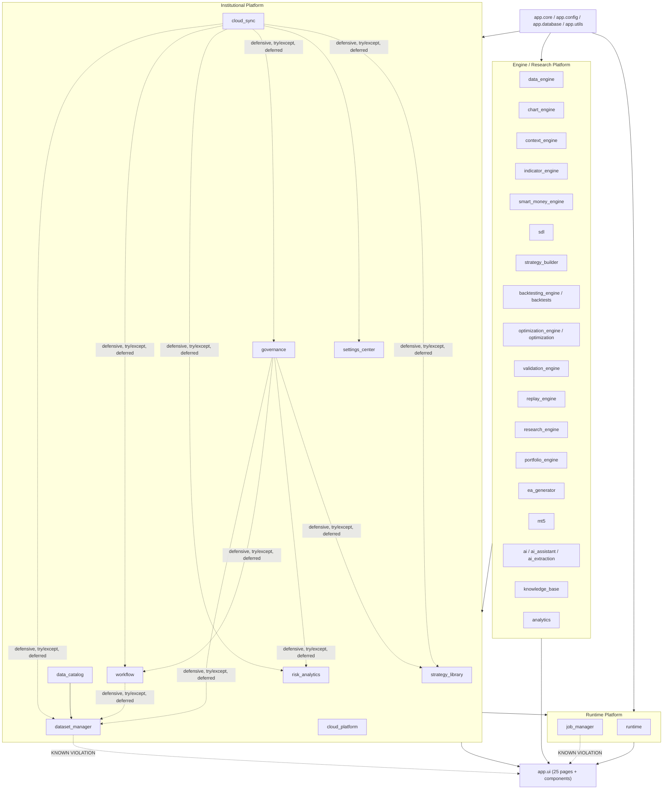

# Module Dependency Map

## Layer graph



Solid arrows = normal, hard, top-level imports (allowed, expected). Dashed arrows = either the sanctioned defensive cross-import pattern (see below) or a documented violation (see `ARCHITECTURE_FREEZE.md`).

## Allowed imports per package (what each package actually imports today)

| Package | Imports from | Never imports from |
|---|---|---|
| `app/core` | stdlib only | Everything else in `app/` |
| `app/config` | `app/core`, stdlib | Everything above Foundation |
| Any Engine package (`data_engine`, `chart_engine`, `indicator_engine`, `sdl`, etc.) | `app/core`, `app/config`, stdlib/3rd-party | Institutional Platform, Runtime Platform, `app/ui` |
| `app/dataset_manager` | `app/core`, `app/config`, `app/data_engine`; **known exception**: `app/ui/dataset_detection` (see `ARCHITECTURE_FREEZE.md`) | `app/workflow`, `app/risk_analytics`, `app/governance`, `app/settings_center`, `app/cloud_sync` |
| `app/data_catalog` | `app/core`, `app/config`, `app/dataset_manager` (hard, direct — catalog.py/usage_tracker.py; a normal downstream dependency, not the defensive pattern) | `app/workflow`, `app/risk_analytics`, `app/governance`, `app/settings_center`, `app/cloud_sync` |
| `app/workflow` | `app/core`, `app/config`, `app/job_manager`; deferred `app/dataset_manager` import inside `_build_execution_context()` | `app/governance`, `app/risk_analytics`, `app/settings_center`, `app/cloud_sync` |
| `app/risk_analytics` | `app/core`, `app/config`, `app/job_manager` | `app/workflow`, `app/governance`, `app/dataset_manager`, `app/settings_center`, `app/cloud_sync` |
| `app/governance` | `app/core`, `app/config`, `app/job_manager`; `workflow_hooks.py` defensively imports `app/dataset_manager`, `app/workflow`, `app/risk_analytics`, `app/strategy_library` (all `try/except`-wrapped, read-only) | `app/settings_center`, `app/cloud_sync` |
| `app/settings_center` | `app/core`, `app/config`, `app/job_manager` only | All other institutional packages (zero cross-imports either direction — the most isolated package in the platform) |
| `app/cloud_sync` | `app/core`, `app/config`; `workspace_sync.py` defensively imports `app/dataset_manager`, `app/workflow`, `app/risk_analytics`, `app/governance`, `app/settings_center`, `app/strategy_library` (all `try/except`-wrapped, read-only) | `app/job_manager` (deliberately — see `INTEGRATION_RULES.md`) |
| `app/job_manager` | `app/core`, `app/config`; **known exception**: `app/ui/progress` (see `ARCHITECTURE_FREEZE.md`) | Institutional Platform packages (job_manager doesn't know what it's running, only that it runs) |
| `app/ui/**` | Everything below it | Nothing above it (UI is the top of the stack) |

## The sanctioned defensive cross-import pattern

`governance/workflow_hooks.py` and `cloud_sync/workspace_sync.py` are the **only** places direct cross-package imports between institutional-platform siblings are allowed, and only in this exact shape:

```python
def resolve_x(...):
    try:
        from app.other_package import Thing
        ...
        return value
    except Exception:  # noqa: BLE001
        return None  # or False, or []
```

One function per concern, local import inside the function body (avoids import-time circularity), a single broad exception handler with a comment explaining why, never raises, never calls a mutating method on the target manager. See [`INTEGRATION_RULES.md`](INTEGRATION_RULES.md) for when a future module may use this pattern.

## No cyclic dependencies

Verified by inspection at freeze time: every institutional-platform package's only imports of siblings are the deferred/defensive ones listed above, and every one of those is strictly read-only (never calls back into a method that could re-enter the importing package). No package imports something that (transitively) imports it back. `settings_center` has zero cross-imports in or out, making it the platform's most decoupled package.
